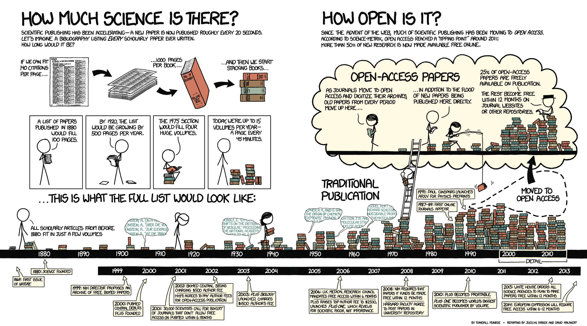

[//]: <> (http://stackoverflow.com/questions/3311940/r-rjava-package-install-failing)

----

<q> Faire le point sur la réplication des modèles de simulations dans le contexte plus large <span class="red">des débats</span> et des outils proposés pour assurer une recherche reproductible</q>

# Débats publics

---- 

<div class="centered">

Pb #1 : Paywall <br/>


</div>

---- 

<div class="centered">

L'affaire JSTOR (2011) <br/>


</div>

----

<div class="centered">
Pb #2 : Reproductibilité 
<blockquote><mark>An article about computational science</mark> in a scientific publication <mark>is not the scholarship itself, it is merely advertising of the scholarship.</mark> The actual scholarship is the complete software development environment, the complete data and the complete set of instructions which generated the figures. David Donoho (1995) @Goble2012</blockquote>
</div>


<blockquote>It should be clear that in order for Computer Science research to be reproducible, several hurdles
have to be cleared: <mark>the source code and test case data have to be available</mark>,  <mark>the code has to build</mark>,  <mark>the execution environment has to be replicated</mark>,  <mark>the code itself has to run to completion</mark>,  <mark>and accurate measurements [...] have to be collected. </mark> In this paper we concentrate on the two most basic of these requirements: <mark>is the source code available, and does it build? </mark> -- @Collberg2014 </blockquote>

----

<div class="centered">

</div>

----

<div class="centered">

Pb #3 : Scandales <br/>

</div>


# L'organisation collective d'une réponse

## Les pionniers
    
<blockquote> [...] The project started with the philosophy that much academic information should be freely available to anyone. It aims to allow information sharing within internationally dispersed teams, and the dissemination of information by support groups. -- Tim Berners-Lee (1991)</blockquote>

<blockquote>In the fall of 1992, a colleague at CERN emailed me: ‘Q: do you know the worldwide-web program?’ I did not, but quickly installed WorldWideWeb.app, serendipitously written by Tim Berners-Lee for the same NeXT computer that I was using, and with whom I began to exchange emails -- Paul Ginsparg (2011) </blockquote>

## Les pionniers

<div class="centered">

</div>

## Les pionniers

- Open Access définit avec démocratisation du web (BOAI 2000's conference)
- Open Data , Open Source , etc.
- <b>Un terme pour les amener tous et dans la communauté les lier ? </b> 

=> <span color="red">Open Science</span>

## Open Science

- des définitions (open data, open access, etc.)
- des manifestes
- une multiplicité d'acteurs (institutions, journaux, chercheurs)
- une problématique à l'échelle mondiale

=> Un terme ressort de la masse, "recherche reproductible" 

# Remise à plat des termes

----

<q> Faire le point sur la réplication des modèles de simulations  dans le contexte plus large des débats et des outils proposés pour assurer <span class="red"> une recherche reproductible </span></q>

----

Reproducible research ? 

<div class="centered">

</div>

<blockquote>A revolution in education and technology transfer follows from the <mark>marriage of word processing and software command scripts</mark>. In this marriage <mark>an author attaches to every figure caption a pushbutton or a name tag usable to recalculate the figure from all its data, parameters, and programs. This provides a concrete definition of reproducibility in computationally oriented research.</mark> -- @Claerbout1992 </mark></blockquote>

----

Replicability, Reproductibility, Repeatability ?

<blockquote> We can reserve the term <mark>Replicability for the regeneration of published results from author-provided code and data.</mark> [...] <mark>Reproducibility is a more general term, implying both replication and the regeneration of findings with at least some independence from the code and/or data associated with the original publication.</mark> Both refer to the analysis that occurs after publication. A third term, <mark>Repeatability</mark>, is sometimes used in place of reproducibility, but this <mark>is more typically used as a term of art referring to the sensitivity of results when underlying measurements are retaken.</mark> -- <b>Victoria Stodden 2011</b></blockquote>

----

@Gent2013, auteur du "Recomputation Manifesto" <br/> <span class="red"><b> Vs </b> </span> <br/> @Drummond2009

<blockquote>Drummond argues powerfully that this - which he calls ‘replicability’ - is the poor cousin of ‘reproducibility’, where experiments are reproduced with changes to factors believed to be insignificant. There is no question that key advances in science should be reproducible in Drummond’s richer sense, but neither do I accept that “the impoverished version, replicability, is one not worth having” -- @Gent2013 </blockquote>

----

<q> Faire le point sur <span class= "red" > la réplication des modèles de simulations </span>  dans le contexte plus large des débats et des outils proposés pour assurer une recherche reproductible</q>

----

Deux conceptions différentes du termes

<blockquote>Though many conceptions of replication may exist, for the purposes of this paper, we will define <mark>replication</mark> <mark>as the implementation (replicated model)</mark> by one scientist or group of scientists (model replicaters) <mark> of a conceptual model described and already implemented (original model) </mark> by a scientist or group of scientists <mark>at a previous time (model builders).</mark> -- @Wilensky2007a</blockquote>

<blockquote>Computing independent replications in the NetLogo platform means initializing the seed of the pseudo-random number generator with different values prior to each run. -- @Reuillon2013</blockquote>

----

<q> Faire le point sur la réplication des modèles de simulations dans le contexte plus large des débats et <span class="red">des outils</span> proposés pour assurer une recherche reproductible</q>

## Des idéaux

<blockquote> <b>OpenNotebook</b> ... there is a <mark>URL to a laboratory notebook</mark> that is freely available and indexed on common search engines. It does not necessarily have to look like a paper notebook but <mark>it is essential that all of the information available to the researchers to make their conclusions is equally available to the rest of the world </mark> -- @Bradley2006 </blockquote>

<blockquote> <b>Litterate programming</b> Je crois que le temps est venu pour une amélioration significative de la documentation des programmes, et que le meilleur moyen d'y arriver est de <mark>considérer les programmes comme des œuvres littéraires</mark>. D'où mon titre, « programmation lettrée ». Nous devons changer notre attitude traditionnelle envers la construction des programmes : <mark>au lieu de considérer que notre tâche principale est de dire à un ordinateur ce qu'il doit faire, appliquons-nous plutôt à expliquer à des êtres humains ce que nous voulons que l'ordinateur fasse.</mark> -- @Knuth1984 </blockquote>

<!---
- Pour les journaux (BOAI, HowOpenIsIt, etc.)
- Pour les institutions (Horizon2020, NSF 2014, Royal Society Science, etc.)
- Pour les disciplines : Psychoterapy (James Coyne), 
--->

- Pour les codes informatiques : 
  - Science Code Manifesto (Barnes 2011)
  - The recomputation manifesto (Gent, Ian P 2013)

## Des outils 

- Des communautées > des outils > des <span color ="red"> innovations </span>

- Un support d'échange privilégié, le navigateur internet

- Une multiplicité d'outils
  - Ecriture collaborative 
  - Dissimination (papiers, données, codes sources)
  
- Des langages clef
  - R (Sweave, Knitr, Rmarkdown)
  - Python (Ipython)

# L'exemple des papier dynamiques avec R

## R interactif 

ggvis ou shiny

```{r ggvis,echo=FALSE}
library(ggvis)
mtcars %>%
  ggvis(~wt, ~mpg) %>%
  layer_smooths(span = input_slider(0.5, 1, value = 1)) %>%
  layer_points(size := input_slider(100, 1000, value = 100))

```

## Vers des outils plus Polyglotte

bla 

## Python reproductible 

```{r engine="python",echo=FALSE}
from mpl_toolkits.mplot3d import Axes3D
import matplotlib.pyplot as plt
import numpy as np

fig = plt.figure()
ax = fig.add_subplot(111, projection='3d')
for c, z in zip(['r', 'g', 'b', 'y'], [30, 20, 10, 0]):
  xs = np.arange(20)
  ys = np.random.rand(20)

# You can provide either a single color or an array. To demonstrate this,
# the first bar of each set will be colored cyan.
cs = [c] * len(xs)
cs[0] = 'c'
ax.bar(xs, ys, zs=z, zdir='y', color=cs, alpha=0.8)

ax.set_xlabel('X')
ax.set_ylabel('Y')
ax.set_zlabel('Z')

plt.savefig("somefilename.png")
```

```{r showfig,include=TRUE,echo=FALSE, results='asis'} 
cat("")
```

# Simulation

## Quel état des lieux ? 

Graphique en cours de réalisation :)

## Quel état des lieux ? 

Ajouter une slide sur le fait que c'est un probleme ancien ... 

<div class="centered">
Survey de @Heath2009 <br/>

</div>

## Un objet de recherche 

<blockquote> Pour @Langlois2005  <mark>Le terme de modélisation désigne à la fois l'activité pour produire un modèle et le résultat de cette activité.</mark> Le concept de modélisation est donc <mark>[...] plus large que celui de modèle, car il recouvre l'activité humaine qui aboutit au modèle achevé, alors que le modèle est un objet (concret ou abstrait), volontairement dépouillé de l'activité qui l'a créé.</mark> </blockquote>

Deux niveaux à prendre en compte : 

- Simulation(s) de modèle
- Exploration(s) de simulation 

## Exemple avec RNetlogo 

R Netlogo, un outil puissant pour générer des rapports dynamique auto-suffisant.

## Quelles contraintes ?

- déposer les données
- déposer les codes sources
- déposer le(s) papier(s) support des expériences

Est ce suffisant ? => Non, en réalité le problème est beaucoup plus complexe !

## Ecosystèmes

- Machine virtuelle
- Suivi et empaquetage de dépendance (packrat, etc.)
- Workflows

# References {.smaller}

