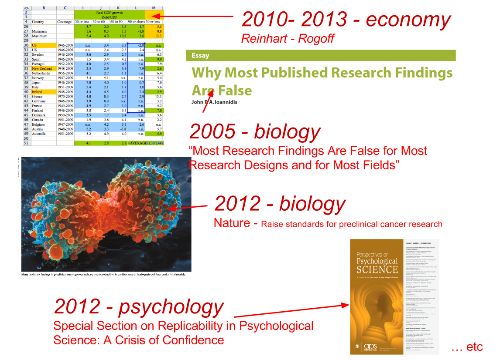
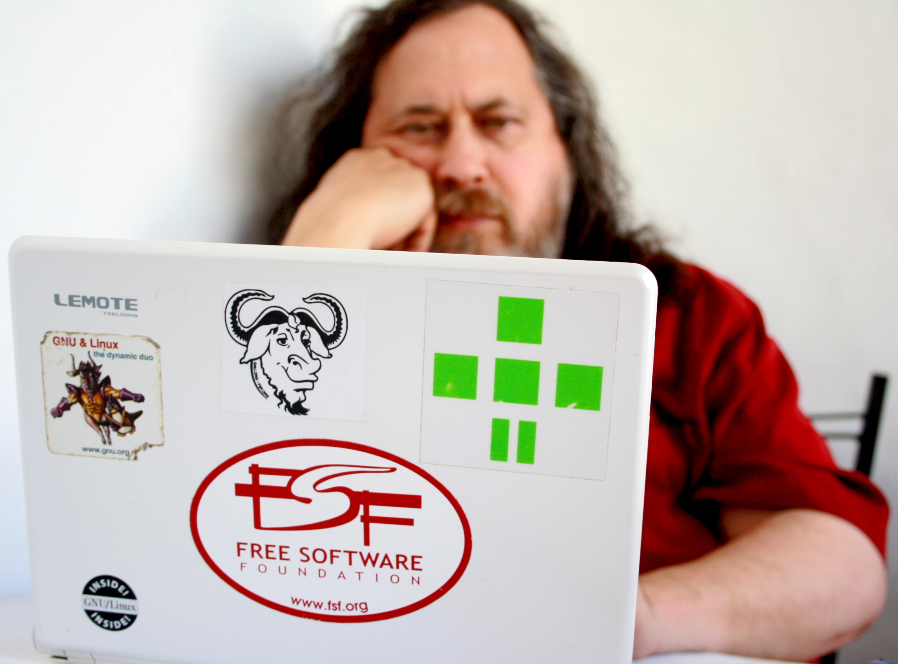
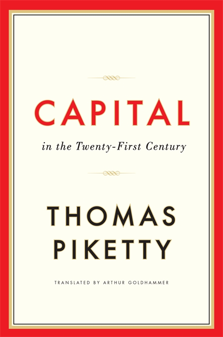
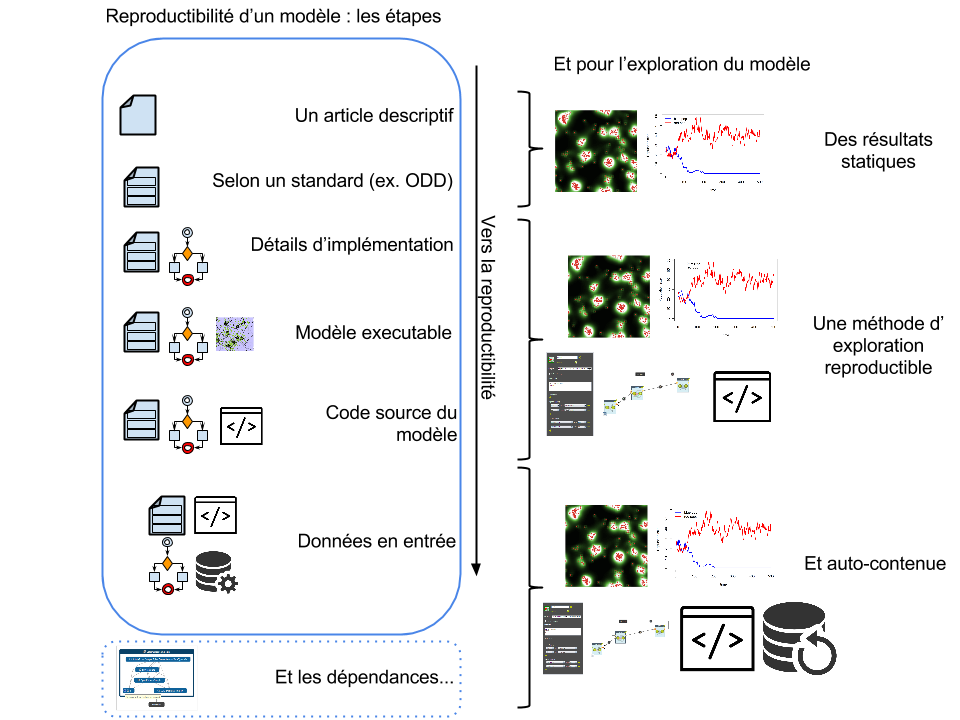

[//]: <> (http://stackoverflow.com/questions/3311940/r-rjava-package-install-failing)

----

<q> Faire le point sur la réplication des modèles de simulations dans le contexte plus large <span class="red">des débats</span> et des outils proposés pour assurer une recherche reproductible</q>

# Débats publics

---- 

<div class="centered">

Pb #1 : Paywall <br/>


</div>

---- 

<div class="centered">

L'affaire JSTOR (2011) <br/>


</div>

----

<div class="centered">
Pb #2 : Reproductibilité 


<!--- 
It should be clear that in order for Computer Science research to be reproducible, several hurdles
have to be cleared: <mark>the source code and test case data have to be available</mark>,  <mark>the code has to build</mark>,  <mark>the execution environment has to be replicated</mark>,  <mark>the code itself has to run to completion</mark>,  <mark>and accurate measurements [...] have to be collected.--->


<blockquote></mark> In this paper we concentrate on the two most basic of these requirements: <mark>is the source code available, and does it build? </mark> -- @Collberg2014 </blockquote>

<div class="centered">

</div>

----

<div class="centered">

Pb #3 : Scandales <br/>
<div class="centered">

</div>

# L'organisation collective d'une réponse

## l'Open Science

<div class="centered">
  
</div>

## l'Open Science

<span class="red"><b>Open Data, Open Access, Open Code, Open Notebook, etc.</b></span>

<blockquote><mark>Open science is the movement </mark>to make scientific research, data and dissemination accessible to all levels of an inquiring society, amateur or professional. It encompasses practices such as <mark>publishing open research, campaigning for open access, encouraging scientists to practice open notebook science, and generally making it easier to publish and communicate scientific knowledge.</mark> -- Wikipedia 2014 </blockquote>

<blockquote> a) Transparency in experimental methodology, observation, and collection of data. b) Public availability and reusability of scientific data. c) Public accessibility and transparency of scientific communication. d) Using web-based tools to facilitate scientific collaboration. -- http://www.openscience.org </blockquote>

----


<!---
<blockquote>The infrastructure school (which is concerned with the technological architecture), the public school (which is concerned with the accessibility of knowledge creation), the “measurement school”(which is concerned with alternative impact measurement), the “democratic school”(which is concerned with access to knowledge) and the “pragmatic school” (which is concerned with collaborative research). -- http://book.openingscience.org 2014 </blockquote>
--->

## Les pionniers (WWW)


<blockquote> [...] <mark>The project started with the philosophy that much academic information should be freely available to anyone.</mark> It aims to allow information sharing within internationally dispersed teams, and the dissemination of information by support groups. -- Tim Berners-Lee (1991) <br/><br/></blockquote>

## Les pionniers (Free software)



<blockquote><mark> Logiciel libre </mark> [free software] désigne des logiciels qui respectent la liberté des utilisateurs. En gros, cela veut dire que <mark>les utilisateurs ont la liberté d'exécuter, copier, distribuer, étudier, modifier et améliorer ces logiciels.</mark> Ainsi, « logiciel libre » fait référence à la liberté, pas au prix. Pour comprendre ce concept, vous devez penser à « liberté d'expression », pas à « entrée libre » -- Free Software Foundation 2014 </blockquote>


<blockquote> Open source software is software that can be freely used, changed, and shared (in modified or unmodified form) by anyone. Open source software is made by many people, and distributed under licenses that comply with the Open Source Definition. -- The Open Source Initiative 2014 </blockquote>

## Les pionniers (Open Access)


<blockquote>In the fall of 1992, <mark>a colleague at CERN emailed me: ‘Q: do you know the worldwide-web program?’ I did not, but quickly installed WorldWideWeb.app, serendipitously written by Tim Berners-Lee for the same NeXT computer that I was using, and with whom I began to exchange emails </mark>-- Paul Ginspard 2011 </blockquote>


<blockquote>Thus was born xxx.lanl.gov, [...] it was originally intended for about 100 submissions per year from a small subfield of high-energy particle physics, but rapidly grew in users and scope, receiving 400 submissions in its first half year.[...] <mark>Renamed in late 1998 to arXiv.org, it has accumulated roughly 700,000 total submissions [mid Aug 2011], currently receives 75,000 new submissions per year, and serves roughly one million full text downloads to about 400,000 distinct users per week. </mark> -- Paul Ginsparg 2011 </blockquote>

## Les pionniers (Open Access)


<blockquote> By <mark> “open access” </mark> to [peer-reviewed research literature], we mean <mark>its free availability on the public internet, permitting any users to read, download, copy, distribute, print, search, or link to the full texts of these articles, crawl them for indexing, pass them as data to software, or use them for any other lawful purpose, without financial, legal, or technical barriers other than those inseparable from gaining access to the internet itself.</mark> The only constraint on reproduction and distribution, and the only role for copyright in this domain, should be to give authors control over the integrity of their work and the right to be properly acknowledged and cited.</blockquote>

## Les pionniers (Open Notebook)


<blockquote> <b>OpenNotebook</b> ... there is a <mark>URL to a laboratory notebook</mark> that is freely available and indexed on common search engines. It does not necessarily have to look like a paper notebook but <mark>it is essential that all of the information available to the researchers to make their conclusions is equally available to the rest of the world </mark> -- @Bradley2006 </blockquote>

# Remise à plat des termes

----

<q> Faire le point sur la réplication des modèles de simulations  dans le contexte plus large des débats et des outils proposés pour assurer <span class="red"> une recherche reproductible </span></q>

----

<div class="centered">

</div>

<blockquote> The term <mark>reproducible research</mark> refers to the idea that the ultimate product of academic research is <mark>the paper along with the full computational environment used to produce the results in the paper such as the code, data, etc. that can be used to reproduce the results and create new work based on the research. </mark> -- Wikipedia </blockquote>

## L'idée sous-jacente

<blockquote> <b>Litterate programming</b> Je crois que le temps est venu pour une amélioration significative de la documentation des programmes, et que le meilleur moyen d'y arriver est de <mark>considérer les programmes comme des œuvres littéraires</mark>.D'où mon titre, « programmation lettrée ». Nous devons changer notre attitude traditionnelle envers la construction des programmes : <mark>au lieu de considérer que notre tâche principale est de dire à un ordinateur ce qu'il doit faire, appliquons-nous plutôt à expliquer à des êtres humains ce que nous voulons que l'ordinateur fasse.</mark> -- @Knuth1984 </blockquote>

<div class="centered">

</div>

## Les précurseurs

<blockquote><mark>An article about computational science</mark> in a scientific publication <mark>is not the scholarship itself, it is merely advertising of the scholarship.</mark> The actual scholarship is the complete software development environment, the complete data and the complete set of instructions which generated the figures. David Donoho (1995) -- @Goble2012</blockquote>

<blockquote>A revolution in education and technology transfer follows from the <mark>marriage of word processing and software command scripts</mark>. In this marriage <mark>an author attaches to every figure caption a pushbutton or a name tag usable to recalculate the figure from all its data, parameters, and programs. This provides a concrete definition of reproducibility in computationally oriented research.</mark> -- @Claerbout1992 </mark></blockquote>

----

<q> Faire le point sur <span class="red">la réplication</span> des modèles de simulations  dans le contexte plus large des débats et des outils proposés pour assurer une recherche reproductible</q>

----

<b>Replicability, Reproductibility, Repeatability ?</b>

<blockquote> We can reserve the term <span class="red">Replicability for the regeneration of published results from author-provided code and data.</span> [...] <span class="green">Reproducibility is a more general term, implying both replication and the regeneration of findings with at least some independence from the code and/or data associated with the original publication.</span> Both refer to the analysis that occurs after publication. A third term, <span class="blue">Repeatability</span>, is sometimes used in place of reproducibility, but this <span class="blue">is more typically used as a term of art referring to the sensitivity of results when underlying measurements are retaken.</span> -- Victoria Stodden 2011</blockquote>

----

<span class="red">Un débat encore très actif sur les termes ... voir par exemple </span>

@Gent2013, auteur du <b>"Recomputation Manifesto"</b> <br/> <span class="red"><b> VS </b> </span> <br/> @Drummond2009

<blockquote>Drummond argues powerfully that this - which he calls <mark>‘replicability’ - is the poor cousin of ‘reproducibility’</mark>, where experiments are reproduced with changes to factors believed to be insignificant. <span class ="red">There is no question that key advances in science should be reproducible in Drummond’s richer sense,  but neither do I accept that “the impoverished version, replicability, is one not worth having”</span>  -- @Gent2013 </blockquote>

----

<q> Faire le point sur la réplication des modèles de simulations dans le contexte plus large des débats et <span class="red">des outils</span> proposés pour assurer une recherche reproductible</q>

<!---
- Pour les journaux (BOAI, HowOpenIsIt, etc.)
- Pour les institutions (Horizon2020, NSF 2014, Royal Society Science, etc.)
- Pour les disciplines : Psychoterapy (James Coyne), 

- Pour les codes informatiques : 
  - Science Code Manifesto (Barnes 2011)
  - The recomputation manifesto (Gent, Ian P 2013)
--->

## Des outils 

<div class="centered">

</div>

# L'exemple des papier dynamiques avec R


## R interactif 

```{r, echo = FALSE}
sliderInput("bins", "Nombre de classes:", min = 1, max = 50, value = 30)

renderPlot({
  x <- faithful[, 2]  # Old Faithful Geyser data
  bins <- seq(min(x), max(x), length.out = input$bins + 1)

  # draw the histogram with the specified number of bins
  hist(x, breaks = bins, col = 'darkgray', border = 'white', main = "Histogramme", ylab = "Fréquence")
})
```

## Python reproductible 

```{r engine="python",echo=FALSE}
from mpl_toolkits.mplot3d import Axes3D
import matplotlib.pyplot as plt
import numpy as np

fig = plt.figure()
ax = fig.add_subplot(111, projection='3d')
for c, z in zip(['r', 'g', 'b', 'y'], [30, 20, 10, 0]):
  xs = np.arange(20)
  ys = np.random.rand(20)

# You can provide either a single color or an array. To demonstrate this,
# the first bar of each set will be colored cyan.
cs = [c] * len(xs)
cs[0] = 'c'
ax.bar(xs, ys, zs=z, zdir='y', color=cs, alpha=0.8)

ax.set_xlabel('X')
ax.set_ylabel('Y')
ax.set_zlabel('Z')

plt.savefig("somefilename.png")
```

```{r showfig,include=TRUE,echo=FALSE, results='asis'} 
cat("")
```

## Format et rendu 

<div class="centered">

</div>

## Exemple de projets 
 
<div class="columns-2">


</div>

# Simulation

----

<q> Faire le point sur <span class= "red" > la réplication des modèles de simulations </span>  dans le contexte plus large des débats et des outils proposés pour assurer une recherche reproductible</q>

---- 

Plusieurs approches, et plusieurs termes

<blockquote><span class = "red"><b>Replication (modelisateur):</b></span> Though many conceptions of replication may exist, for the purposes of this paper, we will define <mark>replication as the implementation (replicated model)</mark> by one scientist or group of scientists (model replicaters) <mark> of a conceptual model described and already implemented (original model) </mark> by a scientist or group of scientists <mark>at a previous time (model builders).</mark> -- @Wilensky2007a</blockquote>

<blockquote><span class = "green"><b>Replication (informaticien)</b></span> Computing independent <mark>replications</mark> in the NetLogo platform <mark>means initializing the seed of the pseudo-random number generator with different values prior to each run</mark>. -- @Reuillon2013</blockquote>

<blockquote><span class = "blue"><b>Docking (modelisateur)</b></span> This paper develops the concepts and methods of a process we will call <mark>"alignment of computational models" or "docking" for short</mark>. <mark>Alignment is needed to determine whether two models can produce the same results</mark>, which in turn is the basis for critical experiments and for tests of whether one model can subsume another. -- @Axtell1996</blockquote>

----

<div class="centered">
Docking et Replication<br/>

</div>

## Quel bénéfices ?

<b><span class="red">- Une aide à la Vérification, pourquoi ? </span></b>

Simpop Local, 3 années de développements, 4 mécanismes, 3 critères d'évaluation,  des millions d'executions pour calibrer, une réplication de netlogo vers scala, et toujours des bugs (voir article  Schmitt 2014)

<b><span class="red">- Un préalable nécessaire à la Validation, pourquoi ? <span/></b>


## Quel objet support de la réplication ?

<blockquote> Pour @Langlois2005 <mark>Le terme de modélisation désigne à la fois l'activité pour produire un modèle et le résultat de cette activité.</mark> Le concept de modélisation est donc <mark>[...] plus large que celui de modèle, car il recouvre l'activité humaine qui aboutit au modèle achevé, alors que le modèle est un objet (concret ou abstrait), volontairement dépouillé de l'activité qui l'a créé.</mark> </blockquote>

Le code source, un objet de recherche reflet d'une construction intellectuelle sur le temps long.

----

<div class="centered">

</div>

----

<div class="centered">

</div>

-----

<div class="centered">

</div>

## Quelle ouverture pour les modèles ?

<div class="centered">

</div>

## Un état des lieux des pratiques  

<blockquote><mark>The sad fact is that new simulations are produced all the time, but rarely does any one stop to replicate the results of any one else’s simulation model.</mark> -- @Axelrod1997</mark></blockquote>

<blockquote>However, <mark>despite this plethora of interesting models, they are rarely compared, built-on or transferred between researchers.</mark> It would seem there is a dearth of "model-to-model" analysis.<mark> Rather researchers tend to work in isolation, designing all their models from scratch and reporting their results without anyone else reproducing what they found. </mark> -- @Hales2003 </blockquote>

<blockquote>Recent years have seen a proliferation of agent-based models in the natural and social sciences. <mark>But with the exception of a few "classic" models, most of these models have never been replicated by anyone but the original developer.</mark> -- @Wilensky2007a</blockquote>

----

<div class="centered">
Survey de @Heath2009 <br/>

</div>

## Un état des lieux des pratiques  

<!---
Liens : http://cfpm.org/m2m/, http://www.insisoc.org/ESSA04/M2M2.htm, http://m2m2007.hutton.ac.uk/m2m_programme.html
--->

<b> <span class="green">Model-to-Model(M2M)</span> (2003 - 2008) </b>

- M2M-1 @Hales2003 (Marseille 2003)
- M2M-2 (Valladolid 2004)
- M2M-3 @Rouchier2008 (Marseille 2007)

=> <b>mais fin des workshop après M2M-3... </b> selon @Rouchier2013

<b> <span class="blue"> Réseau RNSC MAPS  (2009 - 2014) </span> </b>

- 7 Workshops (formation, réplication, conférences)
- Publication fiche pédagogique (2015)

etc.


## Exemple avec RNetlogo 
Charger un modèle, le paramétrer, l'exécuter, et en afficher des résultats réplicables.

```{r, echo = FALSE, message=FALSE}
library(RNetLogo)
  library(ggplot2)
  currentUser <- as.list(Sys.info())$user
  currentSys <- as.list(Sys.info())$sysname
    if (currentUser  == "robin"){
      if (currentSys == "Windows"){
        nlDir <- "C:\\Program Files (x86)\\NetLogo 5.0.4\\"
      	model.path <- "D:\\repositories\\pres-transmondyn\\ColonDyn12.nlogo"
    	} else {
    		nlDir <- "/home/robin/Downloads/netlogo-5.0.5/"
    		model.path <- "/data/repositories/pres-transmondyn/ColonDyn12.nlogo"
    	}
    } else {
      nlDir <- "/home/srey/Binaire/netlogo-5.0.4/"
      model.path <- "/home/srey/TRAVAUX/THESE/REPOSITORY_GIT/presentations/transmondyn_28102014/ColonDyn12.nlogo"
    }

runNetLogo <- function(){
  NLStart(nlDir, gui = FALSE) # start NetLogo "headless"
  NLLoadModel(model.path)
  NLCommand('set Resource_Landscape "Homogeneous"')
  NLCommand('set Ressource-regeneration 3')
  NLCommand('set human-pressure-on-ecology 89')
  NLCommand('set migration-cost 90')
  NLCommand('set Migration-rule "Minimisation of distance and competition"')
  NLCommand("setup")
  NLCommand('random-seed 100')
  # Adapter le path de stockage selon le PC
  results <- NLDoReportWhile(condition = "ticks < 501",
                             command = 'if (ticks mod 10 = 0) [export-view (word "netlogo_img/" ticks ".png")] go',
                             reporter = c("ticks", "globaldensity", "meanlocaldensity", "count groups"),
                             df.col.names = c("tick", "Global_Density", "Local_Density", "Number_of_Groups"),
                             as.data.frame = TRUE)
  NLQuit()
  return(results)
}

```

```{r, echo = FALSE}
shinyApp(
  ui = fluidPage(
    actionButton(inputId = "runModel",label = "Executer le modèle"),
    plotOutput("globalPlot")
  ),
  
  server = function(input, output) {
    
    NLresults <- reactive({
      if (input$runModel > 0){
         NLresults <- runNetLogo()
         }
    })
    
    output$globalPlot <- renderPlot({
      myData <-NLresults()
      if (!is.null(myData)){
    p <- ggplot(myData)
    p + geom_line(aes(x=tick,y=Global_Density, colour = "red")) + 
    geom_line(aes(x=tick,y=Local_Density, colour = "blue")) + 
    geom_line(aes(x=tick,y=Number_of_Groups, colour = "grey")) + 
    scale_colour_manual(name = 'Indicateurs',
                        values=c('grey'='grey','red'='red','blue'='blue'),
                        labels = c('Densité locale', "Nombre de groupes en vie", 'Densité globale')) + 
    ggtitle("ColoDyn results")
          } else {
            return()
          }
    })
  },
  options = list(height = 500)
)
```

----

Mais aussi en observer l'évolution.
```{r, echo = FALSE}
shinyApp(
  ui = fluidPage(
    sliderInput("tick", label = "Pas de temps",
              min = 0, max = 500, value = 0, step = 10,
              animate = animationOptions(interval = 100, loop=FALSE)),
    imageOutput("worldview")
  ),
  
  server = function(input, output) {
    output$worldview <- renderImage({
    filename <- paste("netlogo_img/", input$tick, '.png', sep="")
    list(src = filename, height=350, contentType = 'image/png')
    }, deleteFile = FALSE)
  },
  options = list(height = 500)
)
```


## Deux solutions de dépôt pour NetLogo

- dépot code netlogo, executable en ligne, mais <span class="red"> sans DOI </span> (openABM, modellingCommons, etc.) 

<div class="centered">

</div>


----

- dépot code générique, non executable en ligne, mais <span class="red"> avec DOI </span>

<div class="centered">

</div>

----

<div class="centered">

</div>


## Quel bénéfices ?

<span class="red"> 1 - Plus vite </span> le code source du modèle est disponible, <br/> <span class="red">plus vite il est échangé, discuté, modifié, et répliqué </span> par la communauté d'origine, mais également les autres communautés.
 
<span class="green"> 2 - Plus vite </span> le code source du modèle est disponible, <br/> <span class="green"> plus vite il est adaptable, dérivable par d'autres communautés.</span>
 
<span class="blue"> 3 - Plus vite </span> le code source du modèle est disponible, <br/> <span class="blue"> plus vite </span> il est identifié comme un objet de recherche à part entière.</span>

## Dépots 

- Dépot de la présentation : http://github.com/reyman/pres-transmondyn
- Site web avec ressources (bibliographie, liste de projets open science) : http://transmondyn.sebastienreycoyrehourcq.fr
- Exemple de papier reproductible en simulation  
  - <b> SimpopLocal (Schmitt et al. 2014)</b> : https://github.com/ISCPIF/simpoplocal-epb
  - <b> Cholera (Crooks et al. 2014)</b> : http://css.gmu.edu/Cholera/
  
# References {.smaller}

